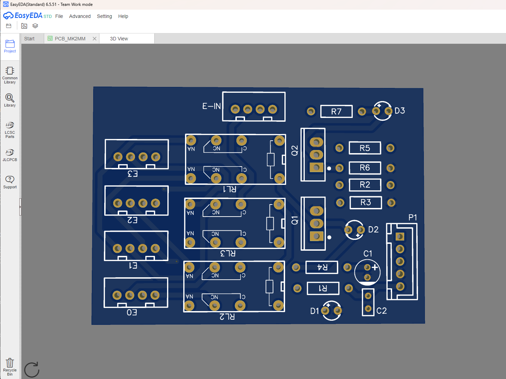

# MMU Stepper Switch

Recreated this circuit with through-hole components

Ready to order JLCPCB gerber attached.

Tested and working with Marlin Firmware.

EasyEDA PCB layout (new)

## BOM

| No. | Quantity | Comment | Designator | Manufacturer Part | Supplier Part | Supplier |
|-----|----------|---------|------------|-------------------|---------------|----------|
| 1 | 1 | 10uF | C1 | UKL1E100KDDANA | C1580057 | LCSC |
| 2 | 1 | 100nF | C2 | CC1E104ZA1FD3F5O10MF | C254077 | LCSC |
| 3 | 3 | L240CTZ0G3MM | D1,D2,D3 | L240CTZ0G3MM | C9900093286 | LCSC |
| 4 | 5 | XH2.54-4P | E0,E1,E2,E3,E-IN | xh2.54-4p | C9900015350 | LCSC |
| 5 | 1 | ZX-XH2.54-5PZZ | P1 | ZX-XH2.54-5PZZ | C7429635 | LCSC |
| 6 | 2 | IRF520NPBF_C709596 | Q1,Q2 | IRF520NPBF-VB | C709596 | LCSC |
| 7 | 3 | 470Ω | R1,R4,R7 | MFR-25JT-52-470R | C176518 | LCSC |
| 8 | 2 | 68Ω | R2,R5 | MFR-25JT-52-68R | C176538 | LCSC |
| 9 | 2 | 10kΩ | R3,R6 | MFR-25JT-52-10K | C176451 | LCSC |
| 10 | 3 | GM-RELAY-R40-V12 | RL1,RL2,RL3 | | | |

